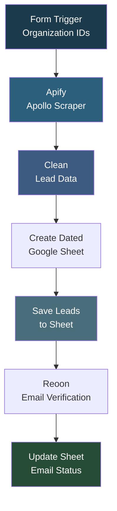

# People Search New Approach

## Overview

An Apollo people search workflow that accepts organization IDs directly through a form, constructs an Apollo search URL targeting sales managers and CEOs at those organizations, scrapes the results via Apify, cleans the data, saves to a dynamically created Google Sheet, and verifies emails using Reoon. This approach skips the domain lookup step by using pre-known Apollo organization IDs for faster processing.

## How It Works

```
Form (comma-separated organization IDs) -> Apify Apollo Scraper (build URL with org IDs, target sales managers + CEOs) -> Clean lead data -> Wait -> Create dated Google Sheet -> Merge -> Save leads -> Wait -> Reoon email verification -> Update sheet with email status
```

### Workflow Diagram



## Integrations

- **Apify** - Apollo people scraping by organization IDs
- **Google Sheets** - Dynamic spreadsheet creation and lead storage
- **Reoon** - Email verification

## Setup

1. Import `People_search_new_approch.json` into your n8n instance.
2. Configure Google Sheets credentials.
3. Update the Apify API token and Reoon API key.
4. Activate and submit the form with comma-separated Apollo organization IDs.
